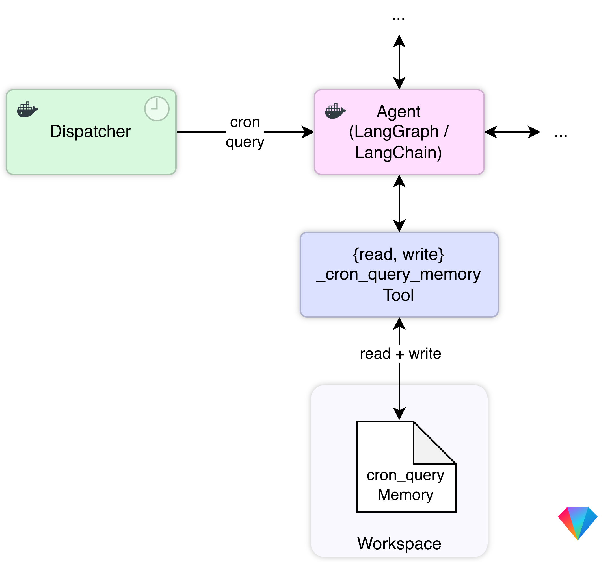

  

# OpenGem 💎

A minimalistic, all-local, fully containerized, open-source AI agent.

## Quick start

`make run`

### Prerequisites

- [Docker](https://www.docker.com/)

## Key concepts

### Full Containerization

**Everything** runs in a container:

- Agent
- Dispatcher
- UI
- Code/Shell commands executed by the agent
- MCP servers

### All local

**Everything** runs locally:

- Agent
- Language model (i.e. [Gemma4](https://deepmind.google/models/gemma/gemma-4/))

### Cron queries and cron query memory

Cron queries are queries that are scheduled to run at specific intervals.
They are triggered by the Dispatcher.

*Cron query memory* is a special type of memory that stores the results of cron queries, allowing the agent to access and reason about this information over time. This enables the agent to have a sense of time and to make decisions based on historical data, which is crucial for tasks that require long-term planning and context awareness.

### Language only settings / configuration

There is no settings UI — all configuration is done through conversation.

## Architecture / Components

### Agent

The core agent is a [LangChain agent](https://docs.langchain.com/oss/python/langchain/agents), following the *ReAct* ("Reasoning + Acting") pattern.

#### PERSONA.md

Comparable to the "system prompt" in a traditional LLM setup. The *persona* defines the agent's identity, behavior, and constraints, and is stored in a dedicated file (`PERSONA.md`).

#### LEARNINGS.md

### Dispatcher

The dispatcher is responsible for handling the cron queries. The cron queries are configured in `workspace/config/cron_queries.json`.

### UI

The UI is based on [assistant-ui](https://github.com/assistant-ui/assistant-ui), a Typescript/React Library for AI Chat.

### MCP Servers

The MCP servers are configured in `workspace/config/mcp_servers.json`.

## Tools

- DuckDuckGo web access (via MCP server)
  - `search`
  - `fetch_content`
- Skills
  - `load_skill`
- E-Mail (via MCP server)
  - `list_available_accounts`
  - `add_email_account`
  - `list_emails_metadata`
  - `get_emails_content`
  - `send_email`
  - `delete_emails`
  - `download_attachment`
- Calendar (via MCP server)
  - `list-calendars`
  - `create-event`
  - `list-events`
  - `update-event`
  - `delete-event`
- Code execution / shell (via LangChain `ShellToolMiddleware`)
  - `shell`
- Cron query memory
  - `read_cron_query_memory`
  - `write_cron_query_memory`
- Configuration / settings
  - Cron Queries
    - `list_cron_queries`
    - `update_cron_query`
    - `delete_cron_query`
  - MCP server configuration
    - `list_mcp_servers`
    - `update_mcp_server`
    - `delete_mcp_server`
  - Skills (via Skill middleware)
    - `list_skills`
    - `upsert_skill`

## Other configuration

- set timezone (`TZ`) in `compose.yaml` 