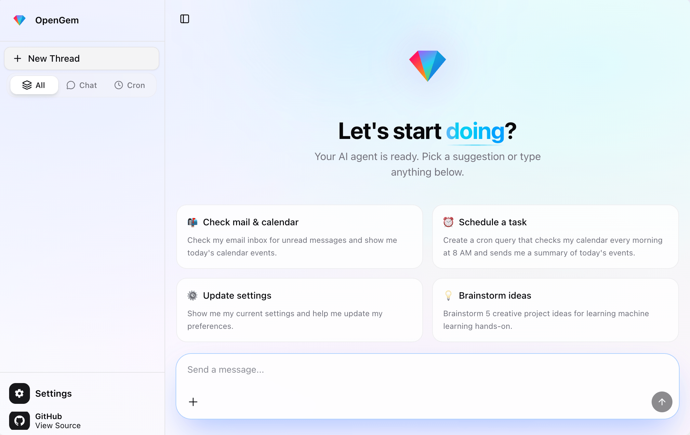
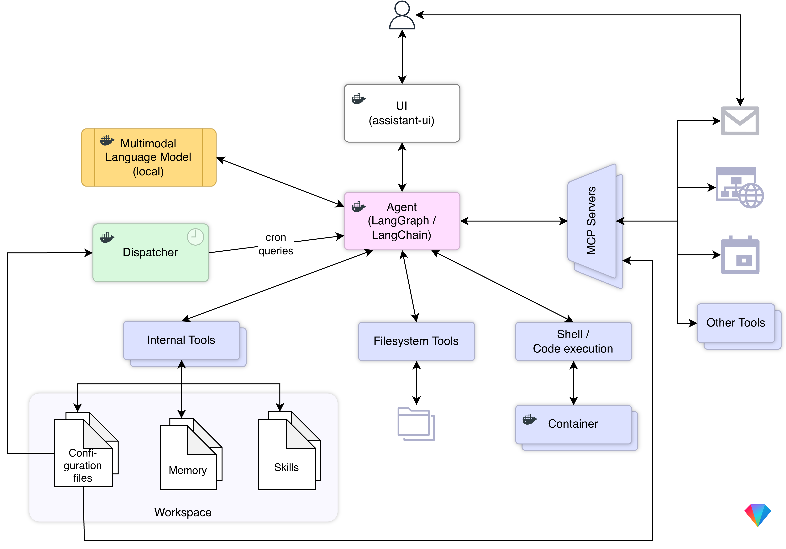

# OpenGem 💎

A minimalistic, all-local, fully containerized, open-source AI agent.

## Quick start

`make run`

### Prerequisites

- [Docker](https://www.docker.com/)

## Key concepts

### Full Containerization

**Everything** runs in a container:

- agent
- dispatcher
- UI
- code/shell commands executed by the agent

### All local

**Everything** runs locally:

- agent
- language model (i.e. [Gemma4](https://deepmind.google/models/gemma/gemma-4/))

### Cron queries and cron query memory

Cron queries are queries that are scheduled to run at specific intervals.

*Cron query memory* is a special type of memory that stores the results of cron queries, allowing the agent to access and reason about this information over time. This enables the agent to have a sense of time and to make decisions based on historical data, which is crucial for tasks that require long-term planning and context awareness.

### Language only settings / configuration

There is no settings UI — all configuration is done through conversation.

## Architecture / Components

### Agent

The core agent is a [LangChain agent](https://docs.langchain.com/oss/python/langchain/agents), following the *ReAct* ("Reasoning + Acting") pattern.

### Dispatcher

The dispatcher is responsible for handling the cron queries.

### UI

The UI is based on [assistant-ui](https://github.com/assistant-ui/assistant-ui), a Typescript/React Library for AI Chat.

## Other configuration

- set timezone (`TZ`) in `compose.yaml` 